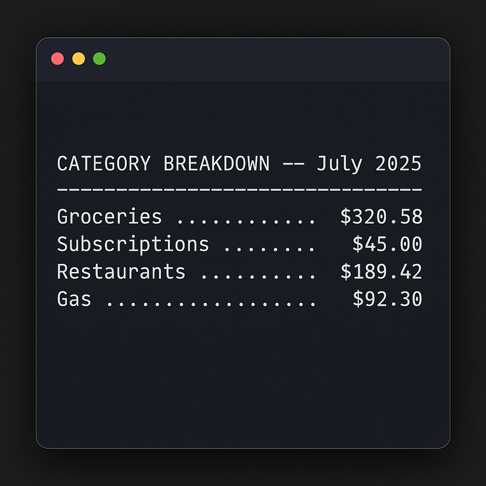
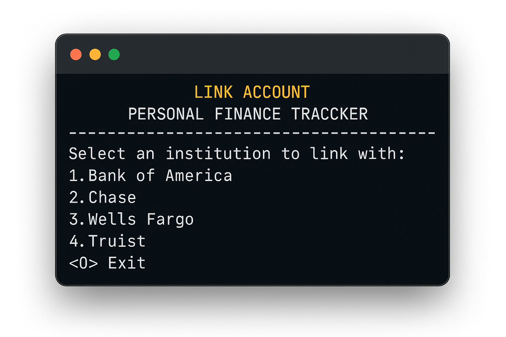
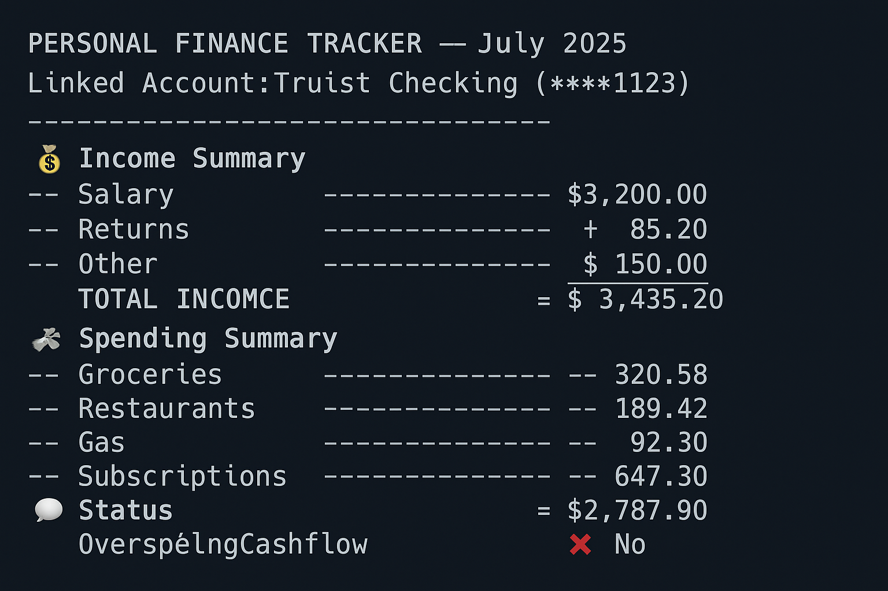
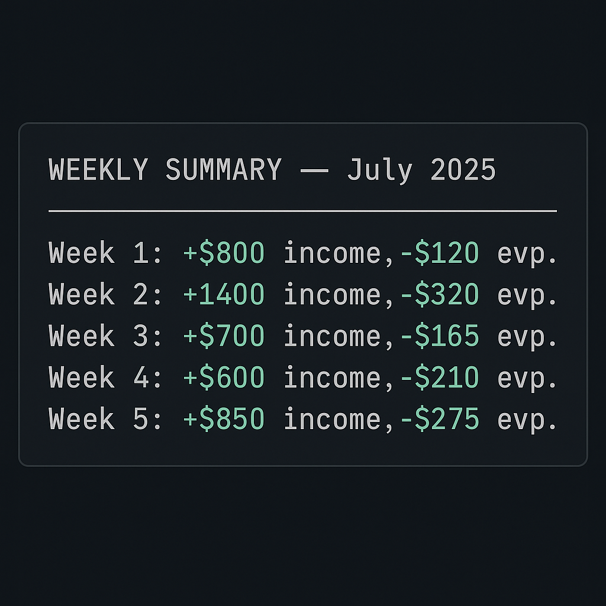

# Personal Finance Tracker

A professional-grade budgeting tool powered by the Plaid API, designed to automate financial data collection and help users make smarter, real-time spending decisions based on actual income, cash flow, and account activity.

---

## 💼 Overview

The Personal Finance Tracker is a CLI-based finance assistant that:

- Connects securely to users' bank accounts using the Plaid API  
- Automatically fetches and refreshes transaction data  
- Categorizes income and spending  
- Filters out returns, overdrafts, and internal transfers  
- Summarizes financial activity weekly or monthly  
- Provides a clear picture of available spending money, dynamically  

This project replaces manual spreadsheets with clean, automated insights — ideal for freelancers, families, and anyone seeking better financial awareness.

---

## 🔗 Plaid API Integration

This app uses the following Plaid products:

| Product                  | Purpose                                                                |
|--------------------------|------------------------------------------------------------------------|
| **Auth**                 | Retrieve routing/account numbers to organize linked accounts           |
| **Transactions**         | Pull historical and live transaction data                              |
| **Transactions Refresh** | Automatically update accounts without reconnecting                     |
| **Statements**           | *(Coming soon)* Download and analyze monthly statements                |
| **Identity**             | Confirm account ownership                                              |
| **Identity Match**       | Match user-provided info to account details for added security         |

---

## 🛠 Features

- ✅ Multi-account support  
- ✅ Auto-categorization of income and expenses  
- ✅ Transfer, return, and overdraft filtering  
- ✅ Weekly and monthly CLI summaries  
- ✅ Category-level breakdown  
- ✅ JSON and CSV export (coming soon)  
- 🚧 Statement viewer and budgeting dashboard in progress  

---

## 🔧 Tech Stack

- **Python 3.10+** — core logic and data processing  
- **Plaid API** — for bank integrations  
- **dotenv** — secure API key management  
- **requests**, **csv**, **json** — data handling  
- **HTML + CSS** — planned frontend UI for reports and dashboards  
- **Flask** *(coming soon)* — lightweight web framework  
- **VS Code** — development environment  

---

## 📁 Project Structure
```bash
personal-finance-tracker/
├── static/                 # CSS and JS files (future web UI)
├── templates/              # HTML templates (Flask will use these)
├── screenshots/            # CLI and UI mockups
├── statements/             # JSON and CSV transaction exports
├── app.py                  # Flask entry point (future)
├── plaid_fetch.py          # Script that pulls transaction data from Plaid API
├── parser.py               # Core logic: filters, summaries, CLI
├── requirements.txt        # Python dependencies
├── .env                    # API keys and config (not committed)
└── README.md               # Project overview and documentation

---

## 🖼️ Screenshots

  
*Spending summary by category for July 2025*

  
*Mock terminal screen to select and link bank accounts*

  
*Monthly summary output*

  
*Weekly income and expenses for July 2025*
---

## 📄 Usage Instructions

Basic CLI usage example:

```bash
python parser.py --month July --exclude transfers returns --category Groceries
```

Coming soon:

- `--save csv`  
- `--group by-week`  
- `--net-cashflow-only`  
- `--export summary.pdf`

---

## 🗺 Roadmap

- Automate transaction pulls using Plaid  
- CLI summaries with category filters  
- Add weekly/monthly report modes  
- Upload project to GitHub with screenshots  
- Monthly statement integration  
- Web dashboard (Flask or React)  
- Spending alerts and insights  
- OAuth-based multi-user support  
- CSV/PDF export and visualization  
- Rule-based auto-tagging (e.g., Venmo = “Transfer”)  
- Build responsive web UI with HTML/CSS  
- Create Flask-based dashboard and views  
- Add chart visualizations (e.g., Chart.js, Plotly)

---

## 🔐 Security Notes

- API keys are stored securely in a `.env` file (never hardcoded)  
- Only read-only access is used for financial data via Plaid  
- No credentials or sensitive user data is stored  
- `.env` and other private files are listed in `.gitignore`

---

## 📫 Contact

Built and maintained by **Jack Barton**  
📍 Sarasota, Florida  
🔗 [https://github.com/jbarton9046](https://github.com/jbarton9046)  
📧 jbarton9046@gmail.com

---

⚠️ **Disclaimer**  
This project is under active development for personal and educational use only. It is not a licensed financial advisor, and no financial decisions should be made solely based on its outputs.
